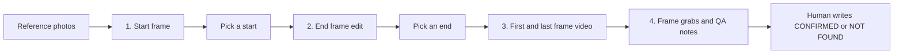

# SceneLock

Turn reference photos into matching start and end frames (same characters, props and light), then animate between them, with no continuity drift.

SceneLock is an open-source rebuild of paid character-consistency and keyframe-to-video features. v0.1 is a four-stage pipeline on the [Comfy Developer Platform](https://cloud.comfy.org):

1. **Start frame.** Character and location references go through an image model (`GeminiImage2Node`, `gemini-3-pro-image-preview` by default).
2. **End frame.** An edit of the chosen start frame, so the table, props, background, and lighting stay locked and only the poses change.
3. **First/last-frame video.** `ByteDanceFirstLastFrameNode` (`seedance-1-5-pro-251215`) between those stills. The template locks the camera. The example scene is 8 seconds at 720p, 9:16.
4. **QA.** ffmpeg grabs frames. A contact sheet and 2x crops are written for a person to review. An optional vision-model reviewer can flag defects. It does not decide.

This is a work-in-progress entry for the [Comfy Dev Platform Challenge](https://blog.comfy.org/p/open-call-comfy-dev-platform-challenge) (deadline 2026-10-19 9am PT). The workflows match graphs that were run on Comfy Cloud. This tree has not been executed against the live API.



## Setup

- Python 3.10+
- ffmpeg on `PATH` (QA frame grabs)
- A Comfy Cloud account
- An API key exported as `COMFY_API_KEY` ([platform.comfy.org](https://platform.comfy.org/profile/api-keys))

```bash
python -m venv .venv
source .venv/bin/activate
pip install -r requirements.txt
```

Optional, for hand crops instead of centre crops: `pip install mediapipe`. QA still runs without it.

## Quickstart

Dry-run fills the workflows and does not need photos or a key:

```bash
python -m scenelock run --scene examples/backyard-burgers/scene.yaml --dry-run
```

Copy that scene, point `refs` at consented photos, then:

```bash
export COMFY_API_KEY=your-key
python -m scenelock start --scene my-scene.yaml -n 4 --yes
python -m scenelock end --scene my-scene.yaml --start outputs/my-scene/start/start_s61001.png -n 2 --yes
python -m scenelock video --scene my-scene.yaml --start outputs/my-scene/start/start_s61001.png --end outputs/my-scene/end/end_s62011.png --yes
python -m scenelock qa --scene my-scene.yaml --video outputs/my-scene/video/video_s64001.mp4 --start outputs/my-scene/start/start_s61001.png --end outputs/my-scene/end/end_s62011.png
```

`run` does all four stages and pauses for a start pick and an end pick. `--auto-pick` keeps variation 0. `--yes` is required before any submit. The CLI prints an approximate credit total first.

```bash
python -m scenelock run --scene my-scene.yaml -n 4 --yes
```

Local dashboard (upload refs, edit the scene, preview prompts, dry-run or spend, pick from a grid):

```bash
python -m scenelock dashboard
```

Opens at `http://127.0.0.1:7860`. The spend checkbox is the dashboard's `--yes`. The key stays in the environment.

## Scene file

`examples/backyard-burgers/scene.yaml` is the shape. You supply the photos. v0.1 expects a location plus two people, because that is the graph that ran.

| Field | Role |
| --- | --- |
| `refs.location` | Location photo. Reference image 1 in the start prompt. |
| `characters` | Two people. List order is reference image 2, then 3. `slot` is left or right and is repeated in the end prompt. |
| `held_object`, `held_hand` | The object stays in that one hand. The other hand gestures. |
| `table_lock` | Props that must not change. Injected into the start prompt, the end prompt, and the video prompt. |
| `start_pose`, `end_pose`, `motion_beat` | What the people do. Guardrails are added around this text. |
| `duration` | Seconds for the video node. 6–8 is the intended range. |
| `aspect_ratio` | Quote it. `"9:16"`. |
| `image_resolution`, `video_resolution` | Example uses `1K` and `720p`. The Cloud run this graph was taken from sent `2K` on the same image node. |
| `table_bbox` | Optional `[x, y, width, height]` in start-frame pixels. QA crops the table region before the SSIM check. |
| `seeds` | Integers per stage. The CLI extends the list when `--count` is larger. |

Quote `aspect_ratio`. Unquoted `9:16` is not a string in YAML.

## Architecture

ComfyUI API-format templates live in `workflows/`. The runner replaces `{{PLACEHOLDERS}}` and submits the graph.

| Call | Use |
| --- | --- |
| `POST /api/upload/image` | Multipart upload. `LoadImage` receives the returned `name`. |
| `POST /api/prompt` | Body `{"prompt": workflow, "extra_data": {"api_key_comfy_org": KEY}}`. Header `X-API-Key`. |
| `GET /api/history_v2/{prompt_id}` | Poll until the job succeeds or fails. |
| `GET /api/view?filename&type&subfolder` | Download images and video. |

Base URL: `https://cloud.comfy.org`.

`workflows/reference/i2v_seedance_v1.json` is the older single-image image-to-video graph. The CLI does not run it. An edit for the end frame is what keeps the table still.

## Repo layout

```
workflows/     start_frame.json, end_frame_edit.json, flf_video.json
scenelock/     CLI and API client (`python -m scenelock`)
qa/            ffmpeg frame grabs, crops, QA_NOTES.md
app/           Gradio dashboard
examples/      backyard-burgers scene, no photos
tests/         pytest, no network
```

Generated files go to `outputs/`, which is gitignored. So are `refs/`, `*.safetensors`, and `.env`.

## Cost

Printed estimates use these approximations. They are not fetched from the account, they do not change with resolution, and partner pricing changes. Confirm the balance before `--yes`.

| Step | Approximate credits |
| --- | --- |
| Nano Banana Pro image (each start or end frame) | ~36 |
| Seedance 1.5 Pro, 720p, 5s | ~27 |
| Seedance 1.5 Pro, 720p, 8s | ~44 |

6s and 7s are a straight interpolation of the 5s and 8s figures (~32.7 and ~38.3). Anything outside 5–8s is marked as extrapolated. A 4-start, 4-end, one 8s video dry-run prints **~332**.

Partner-node rates: [Comfy partner node pricing](https://docs.comfy.org/tutorials/partner-nodes/pricing).

## Lessons baked in

The prompt builders add these on every run. If your pose text fights them, the CLI prints a warning and still includes both.

- Do not start a character mid-action (for example mid-bite, or both hands on the object). Hands melt when the model has to let go. Keep the held object in one hand for the whole clip and gesture with the free hand.
- Make the end frame an edit of the chosen start frame, not a new generation. That is what keeps the table identical. The `table_lock` list is repeated, with the sentence "Do not add, remove, move, resize or relabel any object."
- Keep each person's seat the same in the start prompt and the end prompt. The end prompt says not to swap seats.
- Static camera, in the prompt and as `camera_fixed: true` on the video node. Put the key gesture at about 70% of the clip so it lands before the end frame. Keep motion slow and small. Prefer closed-mouth smiles (open laughing mouths fuse teeth). Keep hands away from faces and necks.
- Pick an end pose that is physically reachable. A hand may rest on the upper arm or shoulder, not the neck.
- Video-review models hallucinate extra limbs from motion blur. QA writes flags into `QA_NOTES.md` with an empty **CONFIRMED / NOT FOUND** column. A human checks the full-res frame grabs and decides. The reviewer hook is off unless you pass `--reviewer package.module:ClassName`. A reviewer subclasses `qa.reviewer.VisionReviewer` and only returns flags.

## QA

`python -m scenelock qa` uses ffmpeg to save the first frame, the last frame, and frames at `--interval` seconds (default 1). It builds `contact_sheet.jpg`, writes 2x zoom crops (MediaPipe hands when that package imports, otherwise the centre of the frame), and compares the first and last video frames to the start and end stills. With `table_bbox` set, that comparison is the table crop. SSIM under 0.8, or a mean absolute grayscale difference above 12, is labeled possible prop drift. Flat areas can keep a high SSIM while the color changes, which is why both numbers are there. They are heuristics, not a measured error rate.

## Likeness and safety

Only use reference photos of people who have consented. The repo ships no private likeness models and no personal photos. The example scene has no alcohol and no branded products. Do not put either into examples you commit.

## Tests

```bash
pytest
```

Template filling, scene parsing, prompt text, the cost gate, dry-run, and QA all run locally. Nothing in the tests calls Comfy Cloud.

## What still needs a live key

- `POST /api/upload/image` returning a `name` the `LoadImage` node accepts
- `GET /api/history_v2/{prompt_id}` while a job is queued, and the output key `SaveVideo` actually uses (`videos`, `images`, or `gifs` are all read)
- Real credit charges versus the table above
- The image node at `1K` (the captured graph sent `2K`) and Seedance first/last-frame at 6–8s
- Dashboard buttons that submit, the variation grid, and playback

`/api/history_v2/{prompt_id}` is the ComfyUI-compatible poll used here. Cloud docs also list `/api/jobs/{job_id}` for the same id.

## License

MIT. See [LICENSE](LICENSE).
